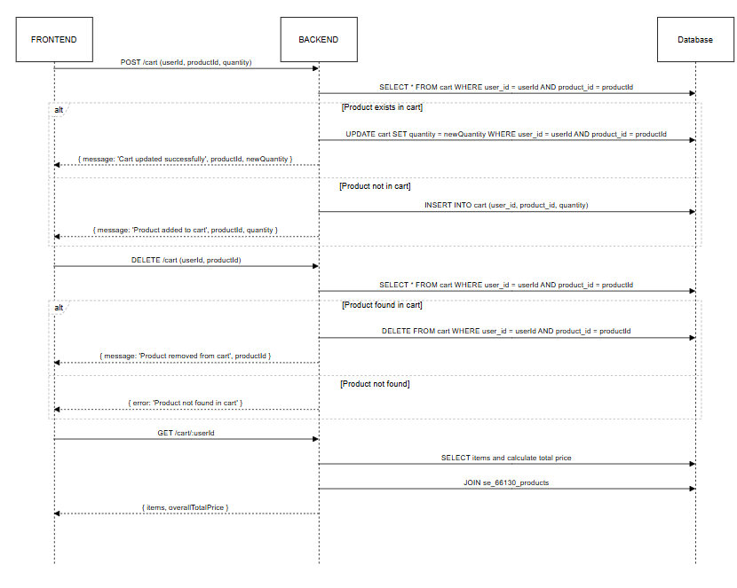

---

# ระบบ Frontend และ Backend ด้วย Next.js, Bun, ElysiaJS และ PostgreSQL


## ภาพรวมระบบ
ระบบนี้ออกแบบเพื่อรองรับฟังก์ชันพื้นฐานของ Web Application เช่น การลงทะเบียนผู้ใช้, การเข้าสู่ระบบ, การแสดงข้อมูลสินค้า, และการเพิ่มสินค้าลงในตะกร้า โดยมีการทำงานร่วมกันระหว่าง Frontend, Backend, REST API และฐานข้อมูล PostgreSQL
---

## Demo live : http://3.0.50.174/login/
## โครงสร้างระบบ
### 1. **Frontend**
   - **Framework:** Next.js, Bun
   - **หน้าที่:**
     - แสดงหน้า UI สำหรับผู้ใช้ เช่น การลงทะเบียน, การเข้าสู่ระบบ, หน้าหลัก, และหน้าตะกร้าสินค้า
     - ติดต่อกับ Backend ผ่าน REST API เพื่อดึงข้อมูลหรือส่งคำขอ
   - **หน้าหลักประกอบด้วย:**
     - **Register:** หน้าสำหรับลงทะเบียนผู้ใช้ใหม่
     - **Login:** หน้าสำหรับเข้าสู่ระบบ
     - **Home:** แสดงข้อมูลสินค้า
     - **Cart:** จัดการรายการสินค้าตะกร้าสินค้า

### 2. **Backend**
   - **Framework:** Bun และ ElysiaJS
   - **หน้าที่:**
     - ประมวลผลคำขอจาก Frontend ผ่าน REST API
     - ติดต่อฐานข้อมูล PostgreSQL เพื่อจัดการข้อมูล เช่น การสร้าง, อ่าน, อัปเดต, และลบ (CRUD)
     - เรียกใช้งาน API ภายนอก (dummyjson) เพื่อดึงข้อมูลเพิ่มเติม
   - **การเชื่อมต่อ:**
     - ติดต่อกับ Frontend ผ่าน REST API
     - ติดต่อกับฐานข้อมูล PostgreSQL ผ่าน SQL
     - ติดต่อกับ API ภายนอก (dummyjson) เพื่อดึงข้อมูลสินค้า

### 3. **ฐานข้อมูล (Database)**
   - **ประเภท:** PostgreSQL
   - **หน้าที่:**
     - เก็บข้อมูลผู้ใช้ เช่น ชื่อ, อีเมล, และรหัสผ่าน
     - เก็บข้อมูลสินค้าที่เกี่ยวข้อง
     - จัดการตะกร้าสินค้า และคำสั่งซื้อ

### 4. **API ภายนอก (dummyjson)**
   - ใช้สำหรับดึงข้อมูลสินค้าในรูปแบบ JSON เพื่อนำไปแสดงในแอปพลิเคชัน

---

## การทำงานของระบบ
1. **ลงทะเบียน (Register):**
   - ผู้ใช้กรอกข้อมูลในหน้าลงทะเบียน
   - Frontend ส่งข้อมูลไปยัง Backend ผ่าน REST API
   - Backend บันทึกข้อมูลลงใน PostgreSQL

2. **เข้าสู่ระบบ (Login):**
   - ผู้ใช้กรอกอีเมลและรหัสผ่าน
   - Frontend ส่งคำขอตรวจสอบข้อมูลไปยัง Backend
   - Backend ตรวจสอบข้อมูลในฐานข้อมูลและตอบกลับผลลัพธ์

3. **แสดงข้อมูลสินค้า (Home):**
   - Frontend เรียก API จาก Backend เพื่อดึงรายการสินค้า
   - Backend ดึงข้อมูลจาก API dummyjson หรือฐานข้อมูล PostgreSQL แล้วส่งกลับไปยัง Frontend

4. **ตะกร้าสินค้า (Cart):**
   - ผู้ใช้เพิ่มหรือแก้ไขสินค้าที่ต้องการซื้อ
   - Frontend ส่งคำขอไปยัง Backend เพื่ออัปเดตฐานข้อมูล

---

## ข้อกำหนดเบื้องต้นในการติดตั้ง
- Bun.js (พร้อม Bun)
- PostgreSQL
---


### คำอธิบายการทำงานของ API



---

#### 1. **POST /cart**
**การเพิ่มสินค้าในตะกร้า**
- ผู้ใช้ส่งคำขอแบบ `POST` เพื่อเพิ่มสินค้าเข้าไปในตะกร้าสินค้า โดยมีข้อมูล:
  - `userId` (ไอดีของผู้ใช้)
  - `productId` (ไอดีของสินค้า)
  - `quantity` (จำนวนสินค้าที่ต้องการเพิ่ม)

**กระบวนการทำงาน:**
1. เซิร์ฟเวอร์ตรวจสอบว่ามีสินค้านี้อยู่ในตะกร้าของผู้ใช้แล้วหรือไม่:
   - หากสินค้าถูกเพิ่มไว้ในตะกร้าแล้ว:
     - เซิร์ฟเวอร์อัปเดตจำนวนสินค้าที่มีอยู่ด้วยการรวมค่าจำนวนใหม่กับค่าจำนวนเดิม
   - หากสินค้าไม่มีอยู่ในตะกร้า:
     - เซิร์ฟเวอร์เพิ่มสินค้าชิ้นใหม่พร้อมข้อมูลจำนวนลงในตะกร้า
2. เซิร์ฟเวอร์ส่งข้อความตอบกลับเพื่อยืนยันว่าเพิ่มหรืออัปเดตสินค้าในตะกร้าเสร็จเรียบร้อย

**การตอบกลับ:**
- หากสำเร็จ: `{ message: 'Cart updated successfully' }` หรือ `{ message: 'Product added to cart' }`
- หากมีข้อผิดพลาด: `{ error: 'Could not add product to cart' }`

---

#### 2. **DELETE /cart**
**การลบสินค้าออกจากตะกร้า**
- ผู้ใช้ส่งคำขอแบบ `DELETE` เพื่อเอาสินค้าออกจากตะกร้า โดยมีข้อมูล:
  - `userId` (ไอดีของผู้ใช้)
  - `productId` (ไอดีของสินค้า)

**กระบวนการทำงาน:**
1. เซิร์ฟเวอร์ตรวจสอบว่าสินค้าที่ผู้ใช้ระบุมีอยู่ในตะกร้าหรือไม่:
   - หากสินค้ามีอยู่:
     - เซิร์ฟเวอร์ลบสินค้าชิ้นนั้นออกจากตะกร้า
   - หากสินค้าไม่มีอยู่:
     - เซิร์ฟเวอร์แจ้งว่าไม่พบสินค้านี้ในตะกร้า
2. ส่งข้อความตอบกลับไปยังผู้ใช้

**การตอบกลับ:**
- หากสำเร็จ: `{ message: 'Product removed from cart' }`
- หากไม่พบสินค้า: `{ error: 'Product not found in cart' }`
- หากเกิดข้อผิดพลาด: `{ error: 'Could not remove product from cart' }`

---

#### 3. **GET /cart/:userId**
**การดึงข้อมูลสินค้าในตะกร้าของผู้ใช้**
- ผู้ใช้ส่งคำขอแบบ `GET` เพื่อดึงรายการสินค้าในตะกร้าของตนเอง โดยระบุ:
  - `userId` (ไอดีของผู้ใช้ใน URL)

**กระบวนการทำงาน:**
1. เซิร์ฟเวอร์ค้นหารายการสินค้าที่อยู่ในตะกร้าของผู้ใช้จากฐานข้อมูล:
   - เชื่อมโยงข้อมูลกับตารางสินค้าหลัก (`se_66130_products`) เพื่อดึงรายละเอียด เช่น ชื่อสินค้า ราคา ส่วนลด
2. คำนวณราคารวมของสินค้าทั้งหมดในตะกร้า:
   - รวมราคาของสินค้าทั้งหมดในแต่ละรายการ
3. ส่งข้อมูลรายการสินค้าและราคารวมกลับไปยังผู้ใช้

**การตอบกลับ:**
- หากสำเร็จ: 
  ```json
  {
    "items": [
      {
        "id": 1,
        "product_id": "101",
        "title": "Product Name",
        "description": "Product Description",
        "price": 50.00,
        "discount_percentage": 10,
        "quantity": 2,
        "thumbnail": "image.jpg",
        "total_price_per_product": 100.00
      }
    ],
    "overallTotalPrice": 100.00
  }
  ```
- หากเกิดข้อผิดพลาด: `{ error: 'Could not fetch cart' }`

---

### สรุป
- **POST /cart** ใช้สำหรับเพิ่มหรืออัปเดตจำนวนสินค้าในตะกร้า
- **DELETE /cart** ใช้สำหรับลบสินค้าออกจากตะกร้า
- **GET /cart/:userId** ใช้สำหรับดึงข้อมูลรายการสินค้าในตะกร้าของผู้ใช้พร้อมราคารวม


## การติดตั้งและเริ่มต้นใช้งาน
1. **Clone โครงการนี้:**  
   ```bash
   git clone <repository-url>
   cd <project-folder>
   ```

2. **ติดตั้ง Dependencies:**  
   ```bash
   bun install
   ```

3. **ตั้งค่าฐานข้อมูล PostgreSQL:**
   - สร้างฐานข้อมูลใหม่
   - อัปเดตการตั้งค่าฐานข้อมูลในไฟล์ `.env`

4. **เริ่มต้น Backend Server:**  
   ```bash
   bun run index.ts
   ```

5. **เริ่มต้น Frontend (Next.js):**  
   ```bash
   bun dev
   ```
---
## การพัฒนาและแก้ไข
- Frontend: แก้ไขไฟล์ภายใต้โฟลเดอร์ `be-shipping/` (Next.js)
- Backend: แก้ไขไฟล์ในโฟลเดอร์ `fe-shopping/` ที่ใช้ ElysiaJS
- ฐานข้อมูล: ใช้คำสั่ง SQL หรือเครื่องมือจัดการ PostgreSQL


ถ้าคุณมีไฟล์ `Dockerfile` และ `docker-compose.yml` อยู่แล้ว คุณสามารถเพิ่มรายละเอียดการรันระบบใน `README.md` ได้ดังนี้:

---

## การรันระบบด้วย Docker Compose

หากคุณมีไฟล์ `Dockerfile` และ `docker-compose.yml` พร้อมใช้งาน คุณสามารถรันระบบได้อย่างรวดเร็วตามขั้นตอนด้านล่าง:

---

### **ข้อกำหนดเบื้องต้น**
1. ติดตั้ง [Docker](https://www.docker.com/) และ [Docker Compose](https://docs.docker.com/compose/)
2. ตรวจสอบว่าไฟล์ `Dockerfile` และ `docker-compose.yml` ถูกตั้งค่าไว้อย่างถูกต้อง

---

### **ขั้นตอนการรัน**

1. **เตรียมไฟล์โปรเจกต์**
   - ตรวจสอบว่าโครงสร้างโปรเจกต์มีไฟล์ที่เกี่ยวข้อง เช่น:
     ```
     ├── be-shipping/
     │   ├── Dockerfile
     ├── fe-shopping/
     │   ├── Dockerfile
     ├── docker-compose.yml
     ├── init.sql
     ```

2. **สร้างและรันคอนเทนเนอร์**
   - เปิด Terminal หรือ Command Prompt แล้วไปยังโฟลเดอร์ที่มีไฟล์ `docker-compose.yml`
   - รันคำสั่ง:
     docker-compose up --build
     คำสั่งนี้จะ:
     - สร้างคอนเทนเนอร์จาก `Dockerfile`
     - รันทุก Service ที่กำหนดใน `docker-compose.yml` เช่น be-shipping, fe-shopping และ Database

3. **ตรวจสอบสถานะคอนเทนเนอร์**
   - ใช้คำสั่ง:
     ```bash
     docker ps
     ```
     เพื่อตรวจสอบว่าคอนเทนเนอร์ทั้งหมดกำลังทำงานอยู่หรือไม่

4. **เข้าถึงระบบ**
   - **Frontend:** เปิดเบราว์เซอร์และเข้าที่ `http://localhost:3000`
   - **Backend:** ตรวจสอบ API Backend ที่ `http://3.0.50.174:4000`
   - **Database:** PostgreSQL รันอยู่ที่ `localhost:5432`

---
### **คำสั่งเพิ่มเติม**

- **หยุดการทำงานของระบบ**
  หากต้องการหยุดคอนเทนเนอร์ทั้งหมด:
  ```bash
  docker-compose down
  ```

- **ลบคอนเทนเนอร์และข้อมูลทั้งหมด**
  หากต้องการเริ่มระบบใหม่และลบข้อมูลเดิม:
  ```bash
  docker-compose down -v
  ```

- **ดู Log ของคอนเทนเนอร์**
  หากต้องการตรวจสอบ Log:
  ```bash
  docker-compose logs -f
  ```

- **รันใหม่พร้อมการ Build ใหม่ทั้งหมด**
  หากมีการอัปเดตไฟล์ `Dockerfile` หรือโค้ด:
  ```bash
  docker-compose up --build
  ```
---

### **การ Debug**
- หากคอนเทนเนอร์ไม่ทำงานหรือมีปัญหา:
  1. ตรวจสอบ Log ด้วยคำสั่ง:
     ```bash
     docker-compose logs
     ```
  2. ตรวจสอบสถานะคอนเทนเนอร์:
     ```bash
     docker ps -a
     ```
