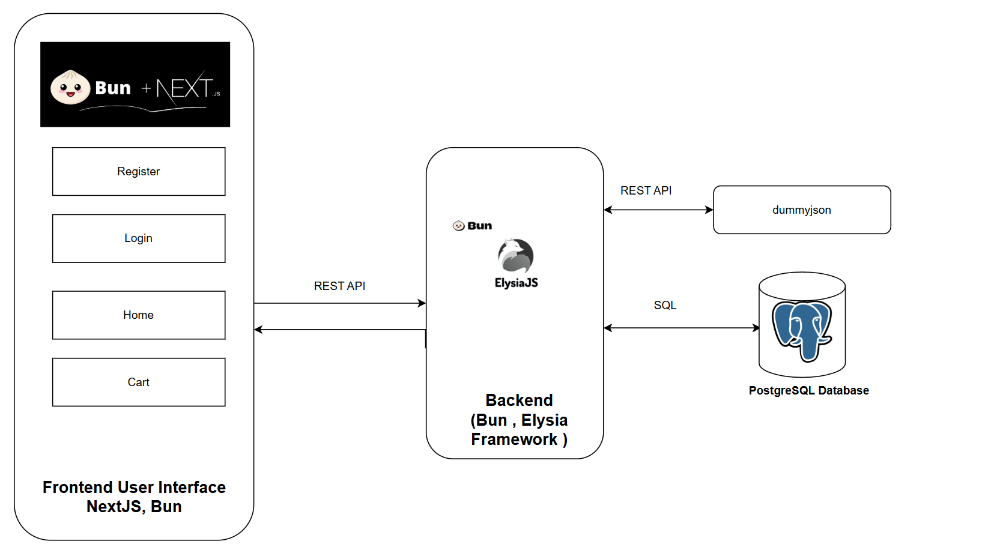

---

# ระบบ Frontend และ Backend ด้วย Next.js, Bun, ElysiaJS และ PostgreSQL




## ภาพรวมระบบ
ระบบนี้เป็นโครงสร้าง Full-stack ที่ถูกออกแบบเพื่อรองรับฟังก์ชันพื้นฐานของแอปพลิเคชัน เช่น การลงทะเบียนผู้ใช้, การเข้าสู่ระบบ, การแสดงข้อมูลสินค้า, และการเพิ่มสินค้าลงในตะกร้า โดยมีการทำงานร่วมกันระหว่าง Frontend, Backend, REST API และฐานข้อมูล PostgreSQL

---

## โครงสร้างระบบ
### 1. **Frontend**
   - **Framework:** Next.js, Bun
   - **หน้าที่:**
     - แสดงหน้า UI สำหรับผู้ใช้ เช่น การลงทะเบียน, การเข้าสู่ระบบ, หน้าหลัก, และหน้าตะกร้าสินค้า
     - ติดต่อกับ Backend ผ่าน REST API เพื่อดึงข้อมูลหรือส่งคำขอ
   - **หน้าหลักประกอบด้วย:**
     - **Register:** หน้าสำหรับลงทะเบียนผู้ใช้ใหม่
     - **Login:** หน้าสำหรับเข้าสู่ระบบ
     - **Home:** แสดงข้อมูลสินค้า
     - **Cart:** จัดการตะกร้าสินค้า

### 2. **Backend**
   - **Framework:** Bun และ ElysiaJS
   - **หน้าที่:**
     - ประมวลผลคำขอจาก Frontend ผ่าน REST API
     - ติดต่อฐานข้อมูล PostgreSQL เพื่อจัดการข้อมูล เช่น การสร้าง, อ่าน, อัปเดต, และลบ (CRUD)
     - เรียกใช้งาน API ภายนอก (dummyjson) เพื่อดึงข้อมูลเพิ่มเติม
   - **การเชื่อมต่อ:**
     - ติดต่อกับ Frontend ผ่าน REST API
     - ติดต่อกับฐานข้อมูล PostgreSQL ผ่าน SQL
     - ติดต่อกับ API ภายนอก (dummyjson) เพื่อดึงข้อมูลสินค้า

### 3. **ฐานข้อมูล (Database)**
   - **ประเภท:** PostgreSQL
   - **หน้าที่:**
     - เก็บข้อมูลผู้ใช้ เช่น ชื่อ, อีเมล, และรหัสผ่าน
     - เก็บข้อมูลสินค้าที่เกี่ยวข้อง
     - จัดการตะกร้าสินค้า และคำสั่งซื้อ

### 4. **API ภายนอก (dummyjson)**
   - ใช้สำหรับดึงข้อมูลสินค้าในรูปแบบ JSON เพื่อนำไปแสดงในแอปพลิเคชัน

---

## การทำงานของระบบ
1. **ลงทะเบียน (Register):**
   - ผู้ใช้กรอกข้อมูลในหน้าลงทะเบียน
   - Frontend ส่งข้อมูลไปยัง Backend ผ่าน REST API
   - Backend บันทึกข้อมูลลงใน PostgreSQL

2. **เข้าสู่ระบบ (Login):**
   - ผู้ใช้กรอกอีเมลและรหัสผ่าน
   - Frontend ส่งคำขอตรวจสอบข้อมูลไปยัง Backend
   - Backend ตรวจสอบข้อมูลในฐานข้อมูลและตอบกลับผลลัพธ์

3. **แสดงข้อมูลสินค้า (Home):**
   - Frontend เรียก API จาก Backend เพื่อดึงรายการสินค้า
   - Backend ดึงข้อมูลจาก API dummyjson หรือฐานข้อมูล PostgreSQL แล้วส่งกลับไปยัง Frontend

4. **ตะกร้าสินค้า (Cart):**
   - ผู้ใช้เพิ่มหรือแก้ไขสินค้าที่ต้องการซื้อ
   - Frontend ส่งคำขอไปยัง Backend เพื่ออัปเดตฐานข้อมูล

---

## ข้อกำหนดเบื้องต้นในการติดตั้ง
- Bun.js (พร้อม Bun)
- PostgreSQL
---

## การติดตั้งและเริ่มต้นใช้งาน
1. **Clone โครงการนี้:**  
   ```bash
   git clone <repository-url>
   cd <project-folder>
   ```

2. **ติดตั้ง Dependencies:**  
   ```bash
   bun install
   ```

3. **ตั้งค่าฐานข้อมูล PostgreSQL:**
   - สร้างฐานข้อมูลใหม่
   - อัปเดตการตั้งค่าฐานข้อมูลในไฟล์ `.env`

4. **เริ่มต้น Backend Server:**  
   ```bash
   bun run index.ts
   ```

5. **เริ่มต้น Frontend (Next.js):**  
   ```bash
   bun dev
   ```

---

## การพัฒนาและแก้ไข
- Frontend: แก้ไขไฟล์ภายใต้โฟลเดอร์ `pages/` (Next.js)
- Backend: แก้ไขไฟล์ในโฟลเดอร์ `backend/` ที่ใช้ ElysiaJS
- ฐานข้อมูล: ใช้คำสั่ง SQL หรือเครื่องมือจัดการ PostgreSQL
